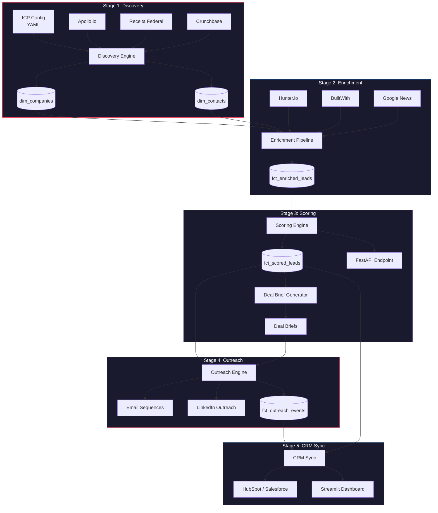
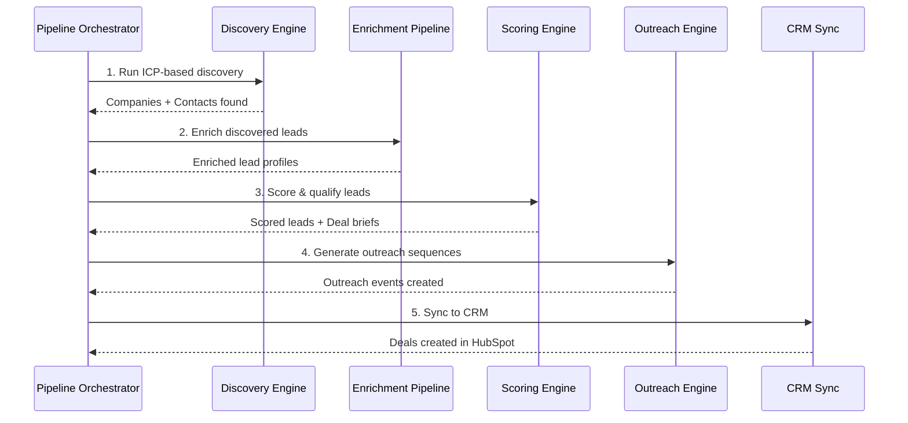
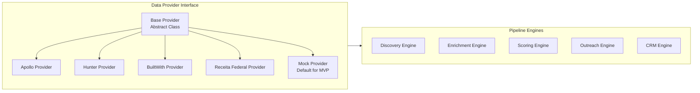

# System Architecture — B2B Autonomous Lead Engine

## High-Level Architecture

```mermaid
graph TB
    subgraph Stage1["Stage 1: Discovery"]
        ICP[ICP Config<br/>YAML] --> DD[Discovery Engine]
        API1[Apollo.io] --> DD
        API2[Receita Federal] --> DD
        API3[Crunchbase] --> DD
        DD --> DC[(dim_companies)]
        DD --> DCT[(dim_contacts)]
    end

    subgraph Stage2["Stage 2: Enrichment"]
        DC --> EP[Enrichment Pipeline]
        DCT --> EP
        HU[Hunter.io] --> EP
        BW[BuiltWith] --> EP
        GN[Google News] --> EP
        EP --> FEL[(fct_enriched_leads)]
    end

    subgraph Stage3["Stage 3: Scoring"]
        FEL --> SE[Scoring Engine]
        SE --> FSL[(fct_scored_leads)]
        FSL --> DBG[Deal Brief Generator]
        DBG --> DB[Deal Briefs]
        SE --> FAPI[FastAPI Endpoint]
    end

    subgraph Stage4["Stage 4: Outreach"]
        FSL --> OE[Outreach Engine]
        DB --> OE
        OE --> EM[Email Sequences]
        OE --> LI[LinkedIn Outreach]
        OE --> FOE[(fct_outreach_events)]
    end

    subgraph Stage5["Stage 5: CRM Sync"]
        FOE --> CS[CRM Sync]
        FSL --> CS
        CS --> HS[HubSpot / Salesforce]
        CS --> DASH[Streamlit Dashboard]
    end

    style Stage1 fill:#1a1a2e,stroke:#e94560,color:#fff
    style Stage2 fill:#1a1a2e,stroke:#0f3460,color:#fff
    style Stage3 fill:#1a1a2e,stroke:#533483,color:#fff
    style Stage4 fill:#1a1a2e,stroke:#e94560,color:#fff
    style Stage5 fill:#1a1a2e,stroke:#0f3460,color:#fff
```

## Pipeline Sequence

```mermaid
sequenceDiagram
    participant P as Pipeline Orchestrator
    participant D as Discovery Engine
    participant E as Enrichment Pipeline
    participant S as Scoring Engine
    participant O as Outreach Engine
    participant C as CRM Sync

    P->>D: 1. Run ICP-based discovery
    D-->>P: Companies + Contacts found
    P->>E: 2. Enrich discovered leads
    E-->>P: Enriched lead profiles
    P->>S: 3. Score & qualify leads
    S-->>P: Scored leads + Deal briefs
    P->>O: 4. Generate outreach sequences
    O-->>P: Outreach events created
    P->>C: 5. Sync to CRM
    C-->>P: Deals created in HubSpot
```

## Database Schema (ERD)

```mermaid
erDiagram
    dim_companies ||--o{ dim_contacts : "has employees"
    dim_companies ||--o{ fct_enriched_leads : "enriched as"
    dim_contacts ||--o{ fct_enriched_leads : "associated with"
    fct_enriched_leads ||--|| fct_scored_leads : "scored as"
    fct_scored_leads ||--o{ fct_outreach_events : "receives outreach"

    dim_companies {
        string company_id PK
        string name
        string industry
        string country
        string state
        int employee_count
        float revenue_usd
        string website
        string tech_stack
        string funding_stage
        datetime discovered_at
        string source
    }

    dim_contacts {
        string contact_id PK
        string company_id FK
        string full_name
        string title
        string email
        string linkedin_url
        string seniority
        string department
    }

    fct_enriched_leads {
        string lead_id PK
        string company_id FK
        string contact_id FK
        string tech_stack_detected
        string buying_signals
        string social_signals
        string news_mentions
        float enrichment_completeness
        datetime enriched_at
    }

    fct_scored_leads {
        string lead_id PK
        float score
        string qualification_status
        bool budget_signal
        bool authority_signal
        bool need_signal
        bool timeline_signal
        string deal_brief
        datetime scored_at
    }

    fct_outreach_events {
        string event_id PK
        string lead_id FK
        string channel
        int sequence_step
        string status
        string response_type
        datetime sent_at
        datetime responded_at
    }
```

## Provider Architecture

```mermaid
graph LR
    subgraph Providers["Data Provider Interface"]
        direction TB
        BP[Base Provider<br/>Abstract Class]
        BP --> AP[Apollo Provider]
        BP --> HP[Hunter Provider]
        BP --> BWP[BuiltWith Provider]
        BP --> RFP[Receita Federal Provider]
        BP --> MP[Mock Provider<br/>Default for MVP]
    end

    subgraph Engine["Pipeline Engines"]
        DE[Discovery Engine]
        EE[Enrichment Engine]
        SE[Scoring Engine]
        OE[Outreach Engine]
        CE[CRM Engine]
    end

    Providers --> Engine
```
